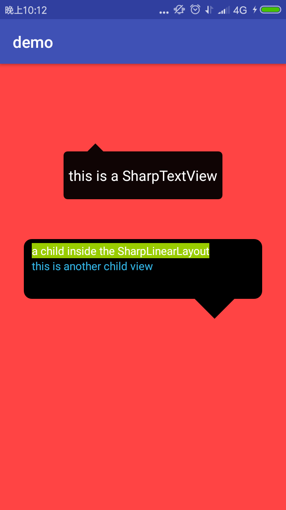

# SharpView
[](https://www.jitpack.io/#zengzhaoxing/SharpView)

custom TextView,LinearLayout,RelativeLayout with sharp

## Screenshots
<a href="ext/sharp_demo.png"></a>

## Import
```java

 Step 1. Add the JitPack repository to your build file
 Add it in your root build.gradle at the end of repositories:
 
	allprojects {
		repositories {
			...
			maven { url "https://jitpack.io" }
		}
	}


Step 2. Add the dependency

	dependencies {
	        compile 'com.github.zengzhaoxing:SharpView:v1.0.0'
	}

```
## Maven
```java
Step 1.
<repositories>
   <repository>
	  <id>jitpack.io</id>
	  <url>https://jitpack.io</url>
   </repository>
</repositories>

Step 2. Add the dependency
<dependency>
    <groupId>com.github.zengzhaoxing</groupId>
    <artifactId>SharpView</artifactId>
    <version>v1.0.0</version>
</dependency>

```
## Directions

* custom properties

name | format | instructions
-----|------|----
radius    | dimension    | radius of the view corner
backgroundColor   | color     | backgroundColor
arrowDirection    | enum    | the sharp location,can be one of the(top,left,right,bottom)
relativePosition   | relativePosition| relative position of the sharp
sharpSize    | dimension    | sharp length

## Usage

* 1.In the XML
```java

       <com.example.xianzi.sharpview.SharpTextView
           android:layout_width="200dp"
           android:layout_height="70dp"
           android:textColor="@android:color/white"
           android:text="this is a SharpTextView"
           android:gravity="center"
           android:textSize="18sp"
           app:radius="5dp"
           app:arrowDirection="top"
           app:backgroundColor="#f0000000"
           app:relativePosition="20%"
           app:sharpSize="10dp"
           />
   
       <com.example.xianzi.sharpview.SharpLinearLayout
           android:id="@+id/sharp_ll"
           android:layout_width="300dp"
           android:layout_height="100dp"
           android:orientation="vertical"
           android:paddingBottom="5dp"
           android:paddingTop="5dp"
           android:paddingLeft="10dp"
           android:layout_marginTop="50dp"
           app:radius="5dp"
           app:arrowDirection="right"
           app:backgroundColor="#f0000000"
           app:relativePosition="100%"
           app:sharpSize="10dp">
   
   
       </com.example.xianzi.sharpview.SharpLinearLayout>

```

* 2.In the code
```java

SharpLinearLayout sharpLinearLayout = (SharpLinearLayout) findViewById(R.id.sharp_ll);
//get the SharpViewRenderProxy of the sharpView to refresh sharp
sharpLinearLayout.getRenderProxy().setArrowDirection(SharpView.ArrowDirection.BOTTOM);
sharpLinearLayout.getRenderProxy().setSharpSize(50);
sharpLinearLayout.getRenderProxy().setRelativePosition(0.8f);
sharpLinearLayout.getRenderProxy().setRadius(20);
sharpLinearLayout.getRenderProxy().setBackgroundColor(0xff000000);

```

# License

Copyright 2017 zengzhaoxing
Licensed under the Apache License, Version 2.0 (the "License");
you may not use this file except in compliance with the License.
You may obtain a copy of the License at

   http://www.apache.org/licenses/LICENSE-2.0

Unless required by applicable law or agreed to in writing, software
distributed under the License is distributed on an "AS IS" BASIS,
WITHOUT WARRANTIES OR CONDITIONS OF ANY KIND, either express or implied.
See the License for the specific language governing permissions and
limitations under the License.
